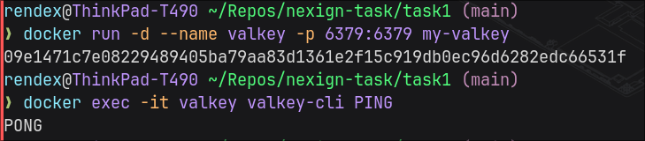
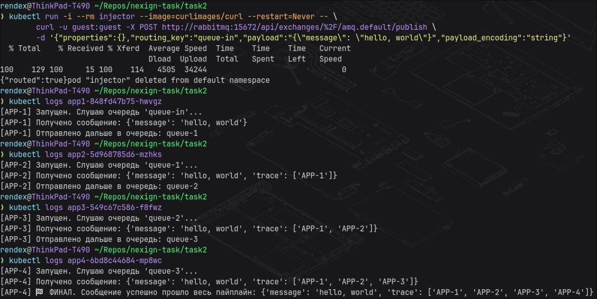

# Отчет по работе

## Задача 1

### Инструкция для запуска

```bash
docker build -t my-valkey .

docker run -d --name valkey -p 6379:6379 my-valkey

docker exec -it valkey valkey-cli PING
```

### Демонстрация работы




## Задача 2

### Инструкция для запуска

```bash

minikube start

eval $(minikube docker-env)

docker build -t pipeline-worker:latest ./app

kubectl apply -f ./manifests/

kubectl run -i --rm injector --image=curlimages/curl --restart=Never -- \
  curl -u guest:guest -X POST http://rabbitmq:15672/api/exchanges/%2F/amq.default/publish \
    -d '{"properties":{},"routing_key":"queue-in","payload":"{\"message\": \"hello, world\"}","payload_encoding":"string"}'

```

Отчет о прохождении пайплайна будет в логах пода app4

### Демонстрация работы:


